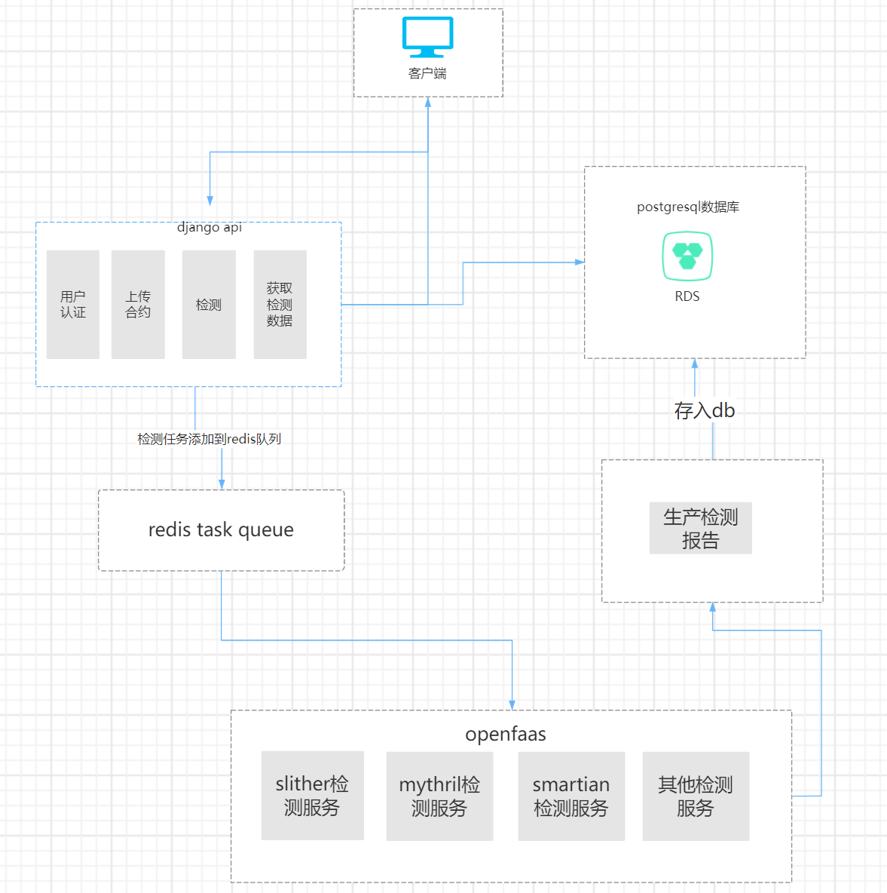

### TechnicalFramework

##### 
The core detection service of the project is developed using Open Faas architecture,
based on Serverless architecture and functional container service based on kubernetes.
There are contract detection services running within Open Faa S, each with a corresponding API,
specifying paths as part of the URL, and each function is a Kubernetes service with multiple copies.
Just like any other Kubernetes workload, it can scale and see and handle multiple concurrent requests 
and facilitate future upgrades in decentralized cloud-native services.
